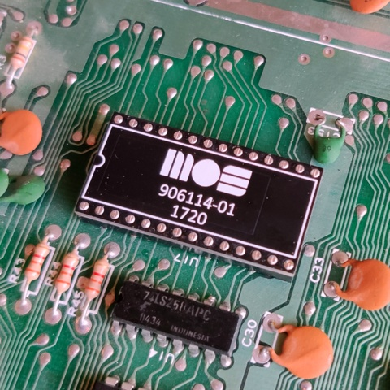

PLA replacement circuit for Commodore 64.
Based on dodgyPLA https://github.com/desaster/c64-dodgypla

I showed the design to some friends and they said "neat". Hence the name neatPLA :)

What is changed compared to dodgyPLA:
- 3.6V voltage regulator. Better for logic levels. Still within XC9536XL specs
- Cool looking PCB
- Changed pin mapping code to mach the new schematic & PCB.
- CASRAM delay increased to 30ns. Fixes timing issues with motherboard 326298
- Added extra delay to all outputs. Fixes a timing issue with motherboard 250425 + SwinSID

Now it is one of the most compatible PLA replacements.

This project includes:
* A Xilinx ISE project written in Verilog for Xilinx XC9536XL
* A Xilinx iMPACT project file (I use this SW and Xilinx Platform cable USB for programming)
* .jed and .svf file for programming the CPLD chip (subfolder _original_dodgyPLA_fix_ got fixed files for the original dodgyPLA and compatible versions)
* Gerber design files for ordering your own PCBs
* Schematic PDF

Part list:
* PCB
* "long leg female headers" or "round pin headers" for pins
* U1 XC9536XL-10VQG44C CPLD
* U2 MCP1702T-3602E/CB 3.6V LDO
* C1, C2 2.2uF X7R 0805 ceramic capacitor
* C3 220nF X7R 0805 ceramic capacitor

PCBs can be ordered with the provided gerber files. You can also buy the PCBs from [PCBway](https://www.pcbway.com/project/shareproject/neatPLA_for_Commodore_64.html)

If you want a ready assembled PCB check my [Amibay sales posts](http://www.amibay.com/showthread.php?111794-neatPLA-The-best-looking-PLA-for-fixing-your-C64-). I charge 14€ + shipping for it.

Programming guide for cheap FT232H board https://github.com/1c3d1v3r/neatPLA/tree/master/programming
