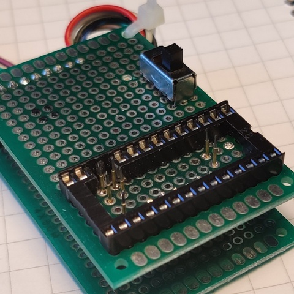

This programming guide for Windows 10 uses the cheap FT232H board. My unit cost 7€ from Aliexpress.

I use it with an adapter which has test needles for the signals.

I also have an TQFP44 to DIL adapter which allow the programming of loose chips.

1. Plug in FT232H adapteri to an USB port. Windows 10 will automatically install default drivers
2. Replace Win10 FTDI default drivers:
	- Download Zadig from https://zadig.akeo.ie/ or directly [here](https://github.com/1c3d1v3r/neatPLA/blob/master/programming/zadig-2.5.exe)
	- Launch Zadic. Select Options List all devices.
	- Select Single RS232-HS (or other compatible FTDI device)
	- Select libusb-win32 as the new driver and click "Replace Driver"

3. Download [xc3sprog.zip](https://github.com/1c3d1v3r/neatPLA/blob/master/programming/xc3sprog.zip). It contains the xc3sprog.exe programming tool and the neatPLA.jed file.
4. Extract .zip file
5. Open CMD and go to extracted folder
6. Connect FT232H board to neatPLA PCB
	- AD0 --> TCK
	- AD1 --> TDI
	- AD2 --> TDO
	- AD3 --> TMS
	- GND --> GND
	- 3.3V --> 3.3V OR 5V --> 5V. Do not connect both! Using 5V verifies the working of the LDO regulator.
7. In CMD give command: xc3sprog -c ft232h -v neatPLA.jed
	The XC9536XL CPLD IC is now programmed.

8. To program more ICs repeat steps 6 & 7.
